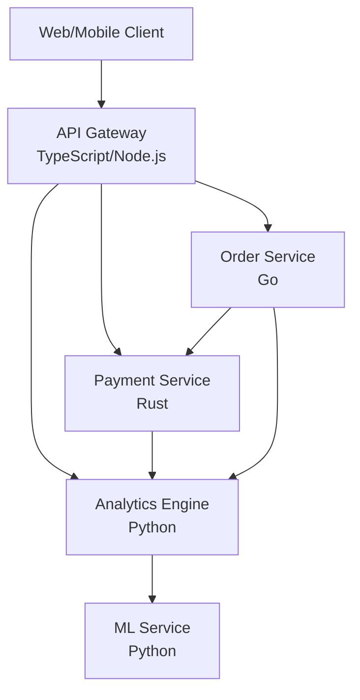
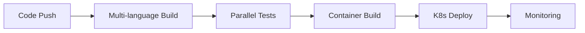

# System Architecture

## Overview

This document describes the high-level architecture of our multi-language, microservices-based system. The architecture is designed for scalability, maintainability, and parallel development.

## Architecture Principles

1. **Language-Agnostic Interfaces**: All services communicate through well-defined interfaces
2. **Microservices**: Each service has a single responsibility
3. **Performance-Optimized**: Choose the right language for each component
4. **Parallel Development**: Teams can work independently on different services
5. **Test-Driven**: All components developed using TDD

## System Components

### Core Services



### Component Descriptions

#### API Gateway (TypeScript/Node.js)
- **Purpose**: Single entry point for all client requests
- **Responsibilities**:
  - Request routing
  - Authentication/authorization
  - Rate limiting
  - Response aggregation
- **Technology**: Express.js, TypeScript, JWT

#### Payment Service (Rust)
- **Purpose**: Handle all payment processing with maximum performance
- **Responsibilities**:
  - Payment processing
  - Transaction logging
  - Fraud detection
  - PCI compliance
- **Technology**: Actix-web, Diesel, Tokio

#### Order Service (Go)
- **Purpose**: Manage order lifecycle with high concurrency
- **Responsibilities**:
  - Order creation/validation
  - Inventory management
  - Order status tracking
  - Fulfillment coordination
- **Technology**: Gin, GORM, Go channels

#### Analytics Engine (Python)
- **Purpose**: Real-time analytics and reporting
- **Responsibilities**:
  - Event processing
  - Metrics aggregation
  - Report generation
  - Data visualization
- **Technology**: FastAPI, Pandas, Apache Kafka

## Data Architecture

### Databases

```yaml
Services:
  Payment Service:
    Primary: PostgreSQL (transactional data)
    Cache: Redis (session data)
    
  Order Service:
    Primary: PostgreSQL (order data)
    Cache: Redis (inventory cache)
    
  Analytics Engine:
    Primary: ClickHouse (time-series data)
    Secondary: S3 (data lake)
```

### Message Queue

- **Technology**: Apache Kafka
- **Topics**:
  - `payment-events`
  - `order-events`
  - `analytics-events`

## Communication Patterns

### Synchronous Communication
- REST APIs for client-facing operations
- gRPC for inter-service communication
- GraphQL for flexible client queries

### Asynchronous Communication
- Event-driven architecture using Kafka
- WebSockets for real-time updates
- Message queues for background jobs

## Security Architecture

### Authentication & Authorization
- JWT tokens for API authentication
- OAuth2 for third-party integrations
- Service-to-service authentication using mTLS

### Data Security
- Encryption at rest (AES-256)
- Encryption in transit (TLS 1.3)
- PCI DSS compliance for payment data

## Deployment Architecture

### Container Strategy
```yaml
Services:
  - Docker containers for all services
  - Kubernetes for orchestration
  - Helm charts for deployment
```

### Environments
1. **Development**: Local Docker Compose
2. **Staging**: Kubernetes cluster (scaled down)
3. **Production**: Multi-region Kubernetes clusters

### CI/CD Pipeline


## Scalability Strategy

### Horizontal Scaling
- All services designed to be stateless
- Auto-scaling based on CPU/memory metrics
- Load balancing at multiple levels

### Performance Optimization
- Rust for CPU-intensive operations
- Go for high-concurrency scenarios
- Python for data processing
- Caching at multiple levels

## Monitoring & Observability

### Metrics
- Prometheus for metrics collection
- Grafana for visualization
- Custom dashboards per service

### Logging
- Structured logging (JSON format)
- Centralized logging with ELK stack
- Log correlation across services

### Tracing
- OpenTelemetry for distributed tracing
- Jaeger for trace visualization
- End-to-end request tracking

## Development Workflow

### Local Development
```bash
# Start all services
docker-compose up

# Run specific service
docker-compose up payment-service

# Run tests
make test
```

### Git Workflow
- Feature branches for development
- Git worktrees for parallel work
- Automated PR checks

## Technology Stack Summary

| Component | Language | Framework | Database | Cache |
|-----------|----------|-----------|----------|--------|
| API Gateway | TypeScript | Express.js | - | Redis |
| Payment Service | Rust | Actix-web | PostgreSQL | Redis |
| Order Service | Go | Gin | PostgreSQL | Redis |
| Analytics Engine | Python | FastAPI | ClickHouse | - |
| ML Service | Python | TensorFlow | - | - |

## Future Considerations

1. **Service Mesh**: Implement Istio for advanced traffic management
2. **Edge Computing**: Deploy services closer to users
3. **Serverless**: Migrate appropriate workloads to serverless
4. **Multi-Cloud**: Avoid vendor lock-in with cloud-agnostic design

## References

- [Microservices Patterns](https://microservices.io/patterns/)
- [12-Factor App](https://12factor.net/)
- [Domain-Driven Design](https://dddcommunity.org/)