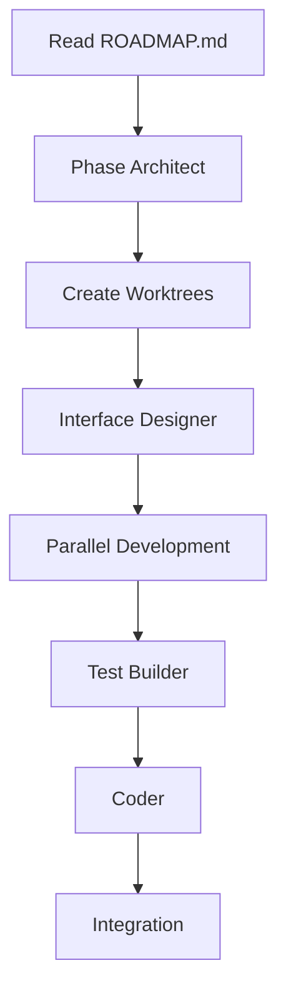

# Getting Started with Claude Code Multi-Language Template

## Quick Start

Get up and running with the Claude Code multi-language development template in 5 minutes.

### Prerequisites

- Claude Code CLI installed
- Git
- Python 3.8+
- Docker (optional, for containerized development)

### Installation

1. **Clone the template**
   ```bash
   git clone https://github.com/your-org/claude-code-template.git
   cd claude-code-template
   ```

2. **Run the setup script**
   ```bash
   ./.claude/scripts/setup-native-subagents.sh
   ```

3. **Verify installation**
   ```bash
   ./.claude/scripts/inventory-check.sh
   ```

## Your First Multi-Language Project

### Step 1: Create a Project Roadmap

Create a `specs/ROADMAP.md` file describing your project phases:

```markdown
# My Project Roadmap

## Phase 1: Core Services
- payment-service (rust) - High-performance payment processing
- order-service (go) - Concurrent order management
- api-gateway (typescript) - REST API gateway
```

### Step 2: Execute a Phase

Use Claude Code to execute your first phase:

```bash
claude
/phase-breakdown 1
```

Claude Code will:
1. Analyze your roadmap
2. Create parallel worktrees
3. Design interfaces
4. Build tests (TDD)
5. Implement features
6. Create pull requests

### Step 3: Monitor Progress

Check the execution status:

```bash
cat .claude/state/current-phase.json
```

## Understanding the Workflow

### Phase Execution Flow



### Agent Roles

1. **Phase Architect**: Orchestrates the entire phase
2. **Interface Designer**: Creates language-agnostic interfaces
3. **Worktree Manager**: Sets up isolated development branches
4. **Test Builder**: Implements TDD tests
5. **Coder**: Writes implementation code
6. **Integration Guardian**: Manages PRs and merging

## Common Use Cases

### 1. Microservices Development

Perfect for building microservices where each service uses the optimal language:

```yaml
Services:
  - Auth Service: Go (high concurrency)
  - Payment Service: Rust (performance critical)
  - Analytics Service: Python (data processing)
  - Web API: TypeScript (developer friendly)
```

### 2. Full-Stack Applications

Build complete applications with:
- Backend: Go/Rust/Python
- Frontend: TypeScript/React
- Mobile: Dart/Flutter
- Infrastructure: Terraform

### 3. Library Development

Create libraries with bindings for multiple languages:
- Core: Rust/C++
- Bindings: Python, Node.js, Go
- Documentation: Automated from code

## Project Structure

```
your-project/
├── .claude/              # Claude Code configuration
│   ├── agents/          # Agent definitions
│   ├── commands/        # Custom commands
│   └── scripts/         # Helper scripts
├── specs/               # Project specifications
│   └── ROADMAP.md      # Development roadmap
├── worktrees/          # Parallel development branches
├── services/           # Your microservices
│   ├── payment/        # Rust service
│   ├── orders/         # Go service
│   └── analytics/      # Python service
└── tests/              # Integration tests
```

## Language Detection

The template automatically detects languages based on:
- Build files: `Cargo.toml`, `go.mod`, `package.json`, etc.
- File extensions: `.rs`, `.go`, `.py`, `.ts`, etc.
- Directory structure conventions

Run language detection:
```bash
./.claude/scripts/detect-language.sh
```

## Working with Phases

### Define Clear Phases

Good phase definition:
```markdown
## Phase 1: Core Infrastructure
- database-schema (sql) - Define all database tables
- config-service (go) - Configuration management
- logging-service (rust) - High-performance logging
```

### Phase Dependencies

Specify dependencies between components:
```markdown
## Phase 2: Business Logic
- payment-processor (rust) - Process payments
  - Depends on: database-schema, config-service
- order-manager (go) - Manage orders
  - Depends on: database-schema, payment-processor
```

## Testing Strategy

### Unit Tests
Each language uses its native testing framework:
- Rust: `cargo test`
- Go: `go test`
- Python: `pytest`
- TypeScript: `jest`

### Integration Tests
```bash
# Run all tests
make test

# Run specific language tests
make test-rust
make test-go
make test-python
```

## Debugging Tips

### 1. Check Agent Logs
```bash
tail -f .claude/logs/execution.log
```

### 2. Validate Interfaces
```bash
claude
"Please verify all interfaces compile correctly"
```

### 3. Review Worktree Status
```bash
git worktree list
```

## Best Practices

1. **Start Small**: Begin with 2-3 components in your first phase
2. **Clear Interfaces**: Define precise contracts between services
3. **Test First**: Let the test-builder create tests before implementation
4. **Incremental Integration**: Merge components regularly
5. **Document as You Go**: Keep README files updated

## Troubleshooting

### Common Issues

**Issue**: "Language not detected"
```bash
# Solution: Check for build files
ls -la **/Cargo.toml **/go.mod **/package.json
```

**Issue**: "Worktree conflicts"
```bash
# Solution: Clean up worktrees
git worktree prune
```

**Issue**: "Tests failing"
```bash
# Solution: Run tests in isolation
cd worktrees/component-name
make test
```

## Next Steps

1. Read the [Architecture Guide](../architecture/README.md)
2. Explore [Example Projects](../../examples/)
3. Learn about [Custom Agents](../../ai-docs/subagents.md)
4. Join our community discussions

## Getting Help

- Documentation: `/docs`
- Examples: `/examples`
- Issues: GitHub Issues
- Community: Discord/Slack

Happy multi-language development with Claude Code! 🚀