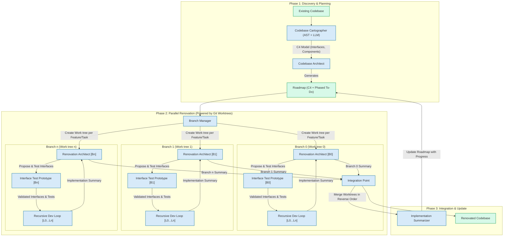

```mermaid
graph TD
    subgraph "Phase 1: Discovery & Planning"
        direction LR
        Codebase["Existing Codebase"] --> Cartographer["Codebase Cartographer (AST + LLM)"];
        Cartographer -- "C4 Model (Interfaces, Components)" --> CodebaseArchitect["Codebase Architect"];
        CodebaseArchitect -- "Generates" --> Roadmap["Roadmap (C4 + Phased To-Do)"];
    end

    subgraph "Phase 2: Parallel Renovation (Powered by Git Worktrees)"
        direction TB
        Roadmap --> BranchManager["Branch Manager"];
        
        subgraph "Branch 0 (Work tree 0)"
            direction TB
            B0_Architect["Renovation Architect [B0]"] -- "Propose & Test Interfaces" --> B0_Tester["Interface Test Prototype [B0]"];
            B0_Tester -- "Validated Interfaces & Tests" --> B0_DevLoop["Recursive Dev Loop [L0...Ln]"];
            B0_DevLoop -- "Implementation Summary" --> B0_Architect;
            B0_Architect -- "Branch 0 Summary" --> MergePoint;
        end

        subgraph "Branch 1 (Work tree 1)"
            direction TB
            B1_Architect["Renovation Architect [B1]"] -- "Propose & Test Interfaces" --> B1_Tester["Interface Test Prototype [B1]"];
            B1_Tester -- "Validated Interfaces & Tests" --> B1_DevLoop["Recursive Dev Loop [L0...Ln]"];
            B1_DevLoop -- "Implementation Summary" --> B1_Architect;
            B1_Architect -- "Branch 1 Summary" --> MergePoint;
        end

        subgraph "Branch n (Work tree n)"
            direction TB
            Bn_Architect["Renovation Architect [Bn]"] -- "Propose & Test Interfaces" --> Bn_Tester["Interface Test Prototype [Bn]"];
            Bn_Tester -- "Validated Interfaces & Tests" --> Bn_DevLoop["Recursive Dev Loop [L0...Ln]"];
            Bn_DevLoop -- "Implementation Summary" --> Bn_Architect;
            Bn_Architect -- "Branch n Summary" --> MergePoint;
        end

        BranchManager -- "Create Work tree per Feature/Task" --> B0_Architect;
        BranchManager -- "Create Work tree per Feature/Task" --> B1_Architect;
        BranchManager -- "Create Work tree per Feature/Task" --> Bn_Architect;
    end

    subgraph "Phase 3: Integration & Update"
        direction TB
        MergePoint["Integration Point"] -- "Merge Worktrees in Reverse Order" --> ImplementationSummarizer["Implementation Summarizer"];
        ImplementationSummarizer -- "Update Roadmap with Progress" --> Roadmap;
        MergePoint --> FinalCodebase["Renovated Codebase"];
    end

    %% Styling
    classDef phase fill:#f2f2f2,stroke:#333,stroke-width:2px;
    classDef git fill:#f9d7d7,stroke:#b85454,stroke-width:2px;
    classDef agent fill:#d7eaf9,stroke:#5499b8,stroke-width:2px;
    classDef artifact fill:#d7f9e8,stroke:#54b882,stroke-width:2px;

    class CodebaseArchitect,Cartographer,BranchManager,B0_Architect,B1_Architect,Bn_Architect,B0_Tester,B1_Tester,Bn_Tester,B0_DevLoop,B1_DevLoop,Bn_DevLoop,ImplementationSummarizer,MergePoint agent;
    class Roadmap,FinalCodebase,Codebase artifact;
```